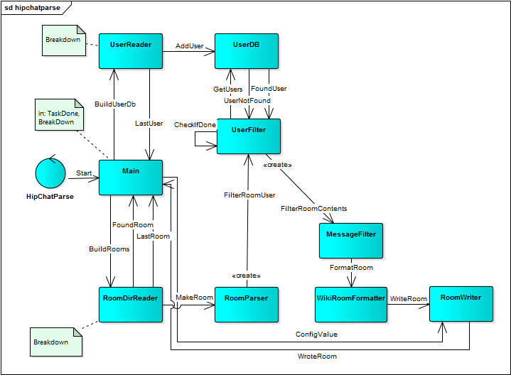

# Parse HipChat JSON to wiki and HTML #
This little project:

1. Reads the files in a HipChat export (must be unzipped, delete rooms that should not be included)
2. Creates wiki markup formatted tables with the contents
    * Deletes empty messages, welcome messages and messages from JIRA and GitHub
    * Replaces @name-references with [~name] -- assumes names in HipChat and Confluence are the same
    * Replaces /code with {noformat}...{noformat}
3. Writes one .room-file for each room, to be inserted as wiki markup in Confluence
    * The result format is

        ```
        h2. <room name>
        
        | date | @user | text |
        | <blank if equal to above> | <ditto> | ... |
        ```

    * The text tables are split at each 1000 rows, to stop Confluence from choking...
    * What looks like URLs are converted into [links]
4. Also creates one large HTML file containing tables with the above structure for each room (+ a TOC) 
    
### Structure ###

The project is written in Scala using Akka, because I can :)

Communication outline:


This is obviously overengineered compared to the task at hand... But why not.
I have tried to make it fairly simple to change, e.g.

* read from API rather than file export
* parse XML (or whatevet) rather than JSON
* produce HTML rather than wiki markup
* write to an API rather than file
* etc

There are several "pipes" that eventually merge:

1. The main class tells the `RoomlistParser` to parse the 'rooms/list.json' file, which in turn sends definitions to the `RoomDb`.
 On receipt of the LastRoom, it is ready to service the filter chain.
2. The main class tells the `UserParser` to parse the 'users/list.json' file, which in turn sends definitions to the `UserDb`.
 On receipt of the LastUser, it is ready to service the filter chain.
3. The main class tells the `RoomDirReader` to list the subdirectories, sending a message to the
 `RoomFileReader`for each directory, which in turn reads alle JSON files in that directory (chronologically), and sends the room definition to the filter chain.
4. The first part of the filter chain is the `RoomFilter`, which by default (configurable) excludes private rooms (found by asking `RoomDb`), and looks up the real name of the room (directory names are somewhat mangled).
 Then the rooms are sent to the `UserFilter`, which looks up users in the `UserDb` to get full names / mention names.
 Next is the `MessageFilter` which excludes welcome messages, empty messages and messages from JIRA and GitHub.
5. The result from filtering is sent to `WikiRoomFormatter` to create formatted contents, followed by
 `RoomWriter` to place the final result in output files (one for each room).


## Usage ##

1. sbt assembly
2. java -jar &lt;....&gt;/hipchatparse.jar baseDir [resultDir]
  (default for resultDir is baseDir)

## Authors ##
lre = Lars Reed, Mesan AS

## Notes ##

### History ###
* v1 2015.08.31 lre Initial version
* v2 2015.09.02 lre Reads room directory
* v3 2015.09.06 lre Includes HTML

### Caveats ###
* Overwrites the result files without warning
* The URL-matching regexp is slow. Added a timeout to parsing to avoid hangs / aborted processing
* There is a timeout to abort if the communication fails, however, it will not abort if an actor hangs while processing a message

### TODO ###
yes...  e.g. 

* Akka-level tests...
* alternative @-mentions
