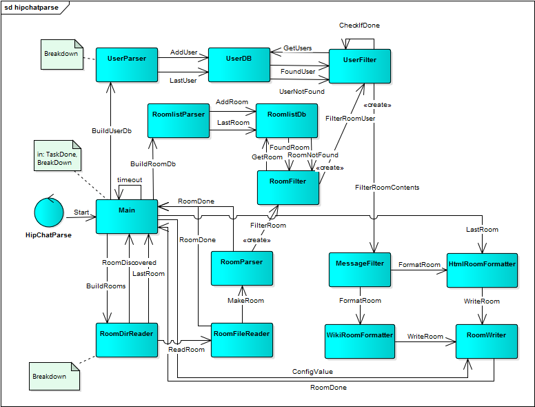

# parse hipchat json #
Dette lille prosjektet:

1. Leser filene i en eksport fra HipChat (må være pakket ut, slett gjerne rom som ikke skal være med)
2. Lager wiki-tabeller med forsøk på brukerreferanser etc (forutsetter like mentions på wiki og chat)
3. Skriver resultatet til filer som kan settes inn som wiki markup i Confluence 

Communication outline:

## Authors ##
lre = Lars Reed, Mesan AS

## Notes ##

### History ###
* v1 2015.08.27 lre Første versjon

### Caveats ###
* Overskriver filene i resultatkatalogen

### TODO ###
Diverse...
